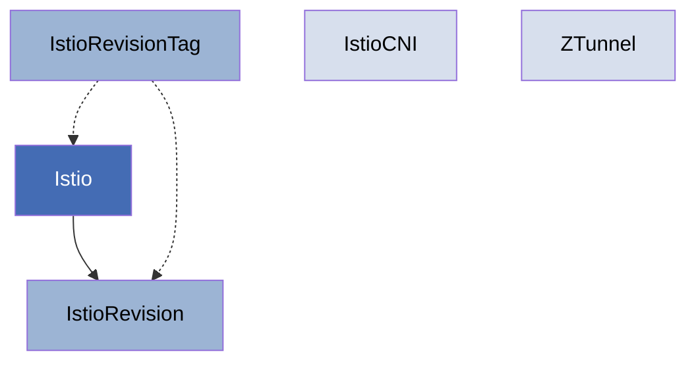

## Introduction

The Sail Operator uses a Kubernetes operator pattern to manage the lifecycle of Istio service mesh deployments. Instead of creating a new configuration schema, the Sail Operator APIs are built around Istio's Helm chart APIs, making all installation and configuration options available through Custom Resource Definitions (CRDs).

## The Operator Pattern

The Sail Operator follows the standard Kubernetes operator pattern:

1. **Declarative Configuration**: You define the desired state of your Istio control plane using custom resources
2. **Reconciliation Loop**: The operator continuously monitors resources and reconciles the actual state with the desired state
3. **Automated Management**: The operator handles installation, upgrades, configuration changes, and lifecycle management

## Resource Hierarchy

The Sail Operator provides five primary custom resources:



### Primary Resources

<CardGroup cols={2}>
  <Card title="Istio" icon="ship" href="/concepts/istio-resource">
    The main resource representing an Istio control plane
  </Card>
  <Card title="IstioRevision" icon="code-branch" href="/concepts/istiorevision-resource">
    A specific revision of a control plane with a unique version
  </Card>
  <Card title="IstioRevisionTag" icon="tag" href="/concepts/istiorevisiontag-resource">
    An alias for control plane revisions enabling stable references
  </Card>
</CardGroup>

### Supporting Resources

<CardGroup cols={2}>
  <Card title="IstioCNI" icon="network-wired" href="/concepts/istiocni-resource">
    Manages the Istio CNI plugin for network configuration
  </Card>
  <Card title="ZTunnel" icon="tunnel" href="/concepts/ztunnel-resource">
    The L4 proxy component for Istio's ambient mode
  </Card>
</CardGroup>

## Resource Relationships

### Istio → IstioRevision

The relationship between `Istio` and `IstioRevision` is similar to Kubernetes' `Deployment` and `ReplicaSet`:

- An `Istio` resource is created by users with desired configuration
- The operator automatically creates a corresponding `IstioRevision` resource
- The `IstioRevision` contains the actual control plane deployment for a specific version
- Users typically don't create `IstioRevision` resources directly

### IstioRevisionTag → Istio/IstioRevision

`IstioRevisionTag` resources create stable aliases:

- Can reference either an `Istio` or `IstioRevision` resource
- When referencing an `Istio`, automatically tracks the active revision
- Enables workload injection using stable labels like `istio.io/rev=prod`
- Simplifies canary upgrades without re-labeling workloads

### Deployment Mode Dependencies

**Sidecar Mode** (Standard):
- Requires: `Istio`
- Optional: `IstioCNI` (required on OpenShift)

**Ambient Mode**:
- Requires: `Istio` + `IstioCNI` + `ZTunnel`
- All three components must be deployed and healthy

## Resource Lifecycle

### Creation Flow

1. User creates an `Istio` resource with desired version and configuration
2. Operator validates the resource and generates a revision name
3. Operator creates a corresponding `IstioRevision` resource
4. `IstioRevision` controller deploys Istio control plane components (istiod, etc.)
5. Status conditions are updated as components become ready

### Update Flow

The update behavior depends on the configured update strategy:

**InPlace Strategy**:
1. User updates the `Istio` resource (e.g., changes version)
2. Operator updates the existing `IstioRevision` in place
3. Control plane components are replaced with new versions
4. Workloads reconnect to the updated control plane

**RevisionBased Strategy**:
1. User updates the `Istio` resource
2. Operator creates a new `IstioRevision` with the new version
3. Both old and new control planes run simultaneously
4. Workloads are migrated to the new revision
5. Old revision is deleted after grace period

### Deletion Flow

1. User deletes an `Istio` resource
2. Operator marks associated `IstioRevision` resources for deletion
3. Control plane components are removed
4. Cleanup of related resources occurs
5. Finalizers ensure proper cleanup order

## Status and Conditions

All Sail Operator resources implement a standard status pattern:

- **ObservedGeneration**: Tracks which version of the spec has been processed
- **Conditions**: Array of typed conditions indicating resource state
- **State**: High-level summary of current health (Healthy, Reconciling, Error, etc.)

### Common Conditions

<AccordionGroup>
  <Accordion title="Reconciled">
    Indicates whether the controller has successfully reconciled all child resources. When `True`, all desired resources have been created or updated.
  </Accordion>
  
  <Accordion title="Ready">
    Indicates whether all components are ready to handle traffic. For `Istio` resources, this means istiod is running and ready. For `IstioCNI` and `ZTunnel`, this means DaemonSets are ready.
  </Accordion>
  
  <Accordion title="InUse">
    Indicates whether the revision is being used by any workloads or namespaces. Used to determine when a revision can be safely deleted.
  </Accordion>
  
  <Accordion title="DependenciesHealthy">
    Indicates whether required dependencies are deployed and healthy. For example, an ambient mode `Istio` requires `IstioCNI` and `ZTunnel` to be healthy.
  </Accordion>
</AccordionGroup>

## Configuration Approach

### Helm Values Integration

All Sail Operator resources expose Istio's Helm chart configuration through a `values` field:

```yaml
spec:
  values:
    pilot:
      resources:
        requests:
          cpu: 100m
          memory: 1024Mi
```

This approach:
- Maintains compatibility with upstream Istio configuration
- Requires no schema translation or mapping
- Supports all Istio configuration options
- Works with existing Istio documentation

### Profile System

Sail Operator supports Istio's profile system:

- **Built-in profiles**: `default`, `demo`, `ambient`, `openshift`, etc.
- **Profile layering**: Platform-specific profiles are automatically applied
- **Value precedence**: User values override profile values
- **ConfigMap inspection**: Final rendered values are stored in ConfigMaps

## Namespace Considerations

All Sail Operator custom resources are **cluster-scoped**, not namespace-scoped:

- `Istio`, `IstioRevision`, `IstioRevisionTag`: Cluster resources
- `IstioCNI`, `ZTunnel`: Cluster resources (with singleton constraint)

However, resources specify target namespaces for component deployment:

- `spec.namespace`: Where to install control plane components
- Default namespaces: `istio-system`, `istio-cni`, `ztunnel`
- Namespace field is typically **immutable** after creation

## Version Compatibility

The Sail Operator follows Istio's versioning:

- Supports n-2 Istio releases (current and two previous minor versions)
- Version format: `v1.29.1` or `v1.29-latest` for latest patch
- Version compatibility checking for dependencies
- CNI plugin compatible with Istio ±1 minor version

<Info>
  The operator manages multiple versions simultaneously, enabling canary upgrades and gradual migration between Istio versions.
</Info>

## Next Steps

<CardGroup cols={2}>
  <Card title="Istio Resource" icon="ship" href="/concepts/istio-resource">
    Learn about the main Istio control plane resource
  </Card>
  <Card title="Update Strategies" icon="rotate" href="/configuration/update-strategies">
    Understand InPlace vs RevisionBased updates
  </Card>
  <Card title="Quick Start" icon="rocket" href="/quickstart">
    Deploy your first Istio control plane
  </Card>
  <Card title="API Reference" icon="book" href="/api/istio">
    Complete API documentation
  </Card>
</CardGroup>
